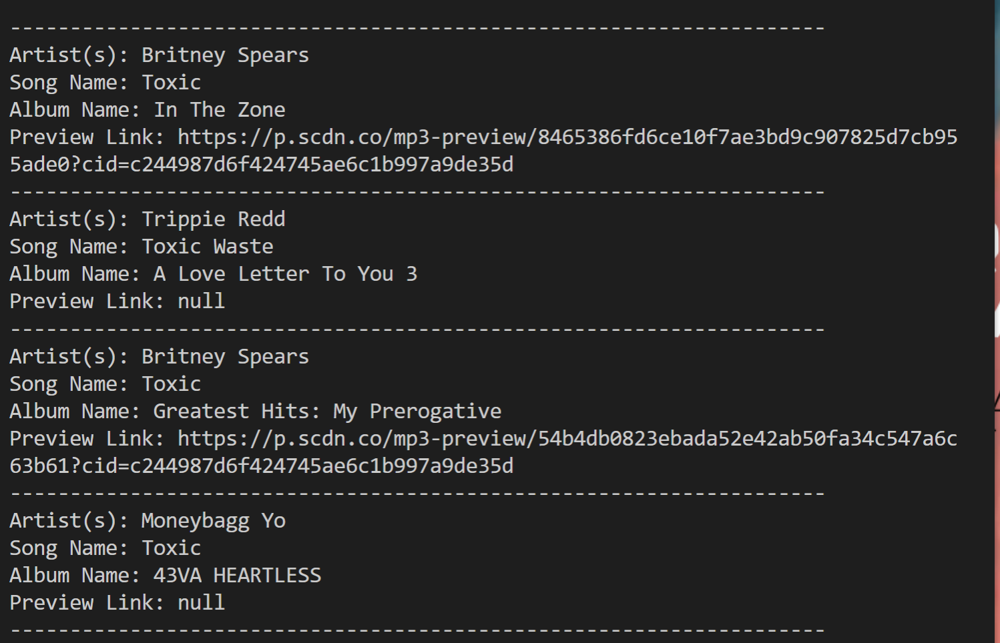

# liri-node-app
LIRI is like iPhone's SIRI. However, while SIRI is a Speech Interpretation and Recognition Interface, LIRI is a Language Interpretation and Recognition Interface. LIRI is a command line node app that takes in parameters and gives you back data.

